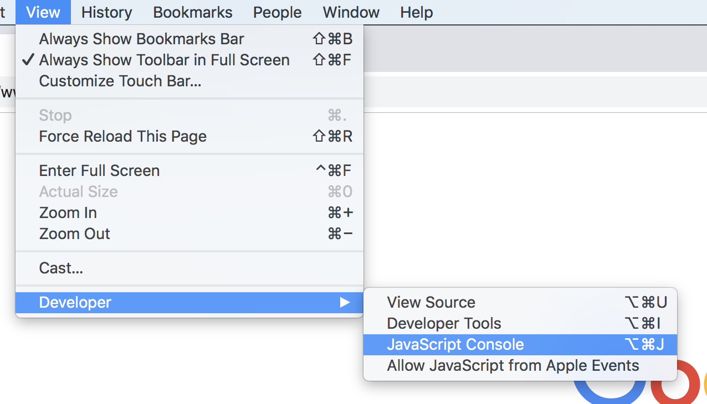
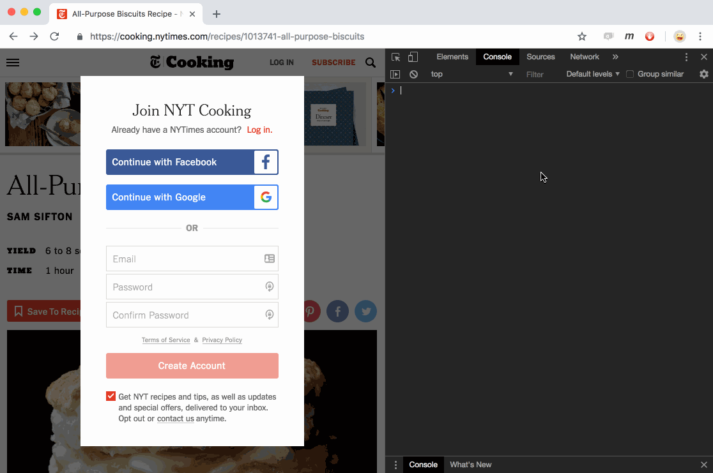

# ny-times-modal
Removes the NY Times subscription modal

Are you tired of looking at recipes on the NY Times Cooking website and running into subscription roadblocks? Me too.

One thing you could do is [Subscribe](https://www.nytimes.com/subscriptions/Multiproduct/lp8R3WU.html)

Another, is open your browser's web inspector, and place this script in the console and hit 'Enter'.

### Open Inspector


### Copy / Paste This into console

```
const modalClass = '.nytc---modal-window---windowContainer';
const modal = document.querySelector(modalClass);

modal.parentElement.innerHTML = '';
document.querySelector('body').style.overflow = 'scroll'
```

Then hit "Enter" to execute the script and remove the modal. 



Happy Cooking!
